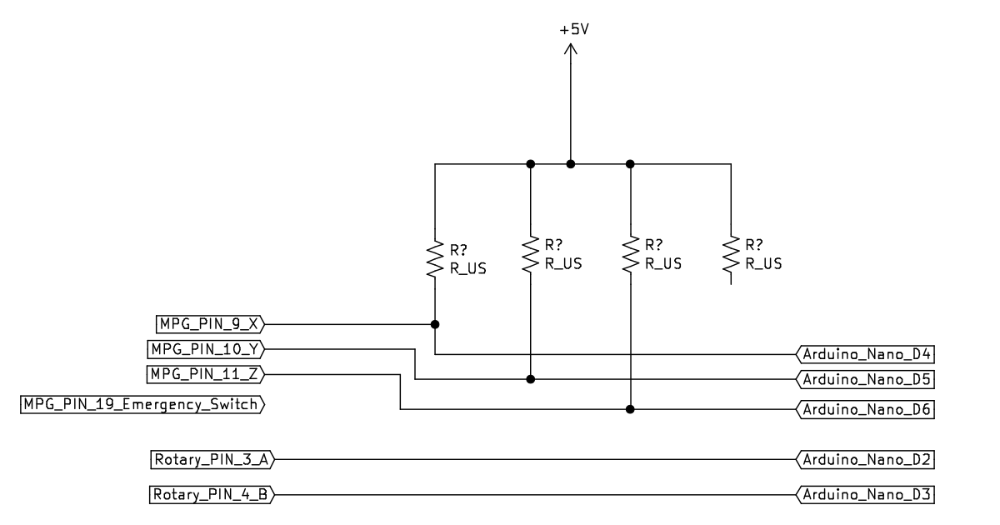

# MPG_pendant
An MPG pendant (Manual Pulse Generator) is a handheld device used in LINUXCNC systems to control axis movement manually. It features a rotary encoder, selector switches, and sometimes an emergency stop for precise adjustments.

**Requirements for MPG pendant**

G1- MPG-TM1474-100B-5L-Z6

Arduino Nano

pull up circuit

**Where to buy**

https://www.amazon.in/Universal-Handwheel-Emergency-Generator-MITSUBISHI/dp/B07CZ7F3Y3

https://www.indiamart.com/proddetail/tosoku-tm1474-100b-5l-z6-mpg-emergency-set-2855265375948.html?mTd=1

**Wheel**

https://www.electronicscomp.com/hand-wheel-pulse-encoder-for-cnc-zss600-100b-5l?

**Wire_study**

https://components101.com/connectors/mil-dtl-24308-db25-parallel-port-connector

  
  
    

### DB25 Port Connector Pinout Configuration

| Pin_Number | Pin_Color | Pin_ArduinoNano  | Pin_Signal  | Pin_Description |
| --- |  --- | --- |  --- | --- |
| 1 |  
RED
 |   | +V, VCC, +5V5  | Rotary Encoder |
| 2 |  
BLACK
  |   | 0V, GND  | Rotary Encoder |
| 3 |  
GREEN
  |D2| A  | Rotary Encoder |
| 4 |  
WHITE
  |D3| B  | Rotary Encoder |
| 5 |  
PURPLE
  |   | A/  | Line Driver Type |
| 6 |  
PURPLE_BLACK
  |   | B/  | Line Driver Type |
| 7 |  
GREEN_BLACK
  |   | +  | Show Lamp |
| 8 |  
WHITE_BLACK
  |   | -, GND  | Show Lamp |
|-|-|-| OFF  | - |
| 9 |  
YELLOW
  | D4| X, 1  | Axis of coordinates |
| 10 |  
YELLOW_BLACK
  |D5| Y, 2  | Axis of coordinates |
| 11 |  
BROWN
  |D6| Z, 3  | Axis of coordinates |
| 12 |  
BROWN_BLACK
  |D7| 4  | Axis of coordinates |
| 13 |  
PINK
  |D8| 5  | Axis of coordinates |
| 14 |  
PINK_BLACK
 |D9| 6  | Axis of coordinates |
|-|-|-| -  |-|
| 15 |  
GRAY
  |A1| X1, 0.1  | Amplificatory Multiple |
| 16 |  
GRAY_BLACK
  |A2| X10, 0.01  | Amplificatory Multiple |
| 17 |  
ORANGE
  |A3| X100, 0.001  | Amplificatory Multiple |
| 18 |  
ORANGE_BLACK
 |   | COM, GND  | Control Switch |
|-|-|-| -  |-|
| 19 |  
LIGHT_BLUE
   |A0| C  | Emergency Switch, Imperative Switch |
| 20 |  
BLUE_BLACK
   |   | CN, GND  | Emergency Switch GND |
| 21 |  
RED_BLACK
   |   | -  | Spare |
| 22 | SHIELD   |-| -| GND/SHIELD |
|-|-|-| -  |-|
| 23 | Not Connected   |-| -| - |
| 24 | Not Connected   |-| -| - |
| 25 | Not Connected   |-| -| - |

	

**PCB prototype**

  
  

