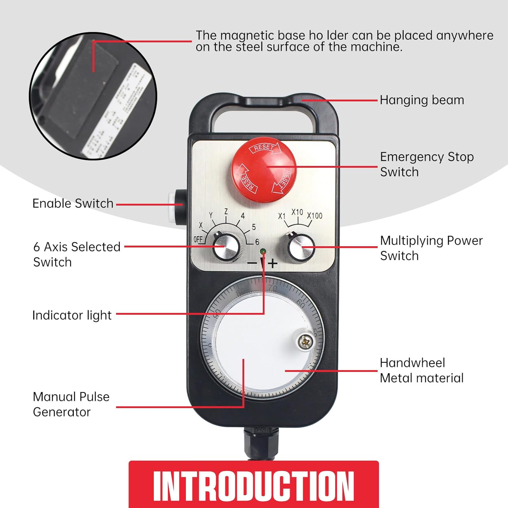

# MPG_pendant
An MPG pendant (Manual Pulse Generator) is a handheld device used in LINUXCNC systems to control axis movement manually. It features a rotary encoder, selector switches, and sometimes an emergency stop for precise adjustments.


**Requirements for MPG pendant**

G1- MPG-TM1474-100B-5L-Z6

Arduino Nano

pull up circuit


**Where to buy**

https://www.amazon.in/Universal-Handwheel-Emergency-Generator-MITSUBISHI/dp/B07CZ7F3Y3

https://www.indiamart.com/proddetail/tosoku-tm1474-100b-5l-z6-mpg-emergency-set-2855265375948.html?mTd=1


**Wheel**

https://www.electronicscomp.com/hand-wheel-pulse-encoder-for-cnc-zss600-100b-5l?


**Wire_study**

https://components101.com/connectors/mil-dtl-24308-db25-parallel-port-connector


<p align="center">
  
  
    
</p>


### DB25 Port Connector Pinout Configuration


| Pin_Number | Pin_Color | Pin_ArduinoNano  | Pin_Signal  | Pin_Description |
| --- |  --- | --- |  --- | --- |
| 1 |  <p>RED</p> |   | +V, VCC, +5V5  | Rotary Encoder |
| 2 |  <p>BLACK</p>  |   | 0V, GND  | Rotary Encoder |
| 3 |  <p>GREEN</p>  |D2| A  | Rotary Encoder |
| 4 |  <p>WHITE</p>  |D3| B  | Rotary Encoder |
| 5 |  <p>PURPLE</p>  |   | A/  | Line Driver Type |
| 6 |  <p>PURPLE_BLACK</p>  |   | B/  | Line Driver Type |
| 7 |  <p>GREEN_BLACK</p>  |   | +  | Show Lamp |
| 8 |  <p>WHITE_BLACK</p>  |   | -, GND  | Show Lamp |
|-|-|-| OFF  | - |
| 9 |  <p>YELLOW</p>  | D4| X, 1  | Axis of coordinates |
| 10 |  <p>YELLOW_BLACK</p>  |D5| Y, 2  | Axis of coordinates |
| 11 |  <p>BROWN</p>  |D6| Z, 3  | Axis of coordinates |
| 12 |  <p>BROWN_BLACK</p>  |D7| 4  | Axis of coordinates |
| 13 |  <p>PINK</p>  |D8| 5  | Axis of coordinates |
| 14 |  <p>PINK_BLACK</p> |D9| 6  | Axis of coordinates |
|-|-|-| -  |-|
| 15 |  <p>GRAY</p>  |D10| X1, 0.1  | Amplificatory Multiple |
| 16 |  <p>GRAY_BLACK</p>  |D11| X10, 0.01  | Amplificatory Multiple |
| 17 |  <p>ORANGE</p>  |D12| X100, 0.001  | Amplificatory Multiple |
| 18 |  <p>ORANGE_BLACK</p> |   | COM, GND  | Control Switch |
|-|-|-| -  |-|
| 19 |  <p>LIGHT_BLUE</p>   |D13| C  | Emergency Switch, Imperative Switch |
| 20 |  <p>BLUE_BLACK</p>   |   | CN, GND  | Emergency Switch GND |
| 21 |  <p>RED_BLACK</p>   |   | -  | Spare |
| 22 | SHIELD   |-| -| GND/SHIELD |
|-|-|-| -  |-|
| 23 | Not Connected   |-| -| - |
| 24 | Not Connected   |-| -| - |
| 25 | Not Connected   |-| -| - |

	


**PCB prototype**


<p align="center">
  
  
</p>


# Stage_1

This method provides a simple way to connect pins, manage signals, and store parameter values.

 - halcmd - manipulate the LinuxCNC HAL from the command line


 - How to run halcmd
 - Manipulate the linuxcnc HAL from the command line


**Source_code**

```
https://github.com/LinuxCNC/linuxcnc/tree/master/src/hal

```


```
halrun -I
```

 - Input file

```
halcmd -f <filename>

```


**halcmd Command list**


       loadrt <modname>     # load realtime module
unloadrt <modname>           # unload realtime module


loadusr <compname>        # load Userspace component
unloadusr <compname> unload Userspace component


       waitusr <name> # wait for Userspace component
unload <compname> Unloads  a  non-realtime component or realtime module.


       newsig signame type  #  Creates a new HAL signal called signame 

       delsig signame     # delete signal


       linkpp      #  pinname1 [arrow] pinname2
       linkps      #  pinname [arrow] signame
       linksp       # signame [arrow] pinname
       
 net signame pinname #   Create  signname to match the type of pinname 
       
unlinkp pinname            # unlink  pin


 getp, gets  <name>      # get the value parameter, pin  or signal
 
 ptype, stype <name>     # get the type parameter, pin or signal
 
 setp, sets  <name>     # set the value parameter, pin or signal 


       addf functname threadname  # add function
 
       delf functname threadname  # delete function


       show [item] # Prints HAL items to stdout in human readable format.

       list type [pattern] # Prints the names of HAL items of the specified type.
       
```
       ex:    list funct
              list comp
              list pin
              list sig
              list thread
```

       source  filename.hal  # Execute the commands from filename.hal.

```
                  source <file_location/../../<filename.hal>>
                  
```


       status [type]  #                 Prints status info about HAL.

```
                  status lock
                  status mem
                  status all
                  
```


       debug [level]  #  Sets the rtapi messaging level
       
```
                  debug
                  0=None
                  1=ErrorOnly
                  2=Warnings
                  3=INfo
                  4=Debug
                  5=AllMessages
      
``` 


       save [item]   # Prints HAL items to stdout in the form of HAL commands.
                     # help to backup


``` 
                  save comp
                  save alias
                  save sig | link | net | param | all | <filename.hal>


``` 


       start #  Starts  execution  of realtime threads. 

 stop   # Stops execution of realtime threads.


alias type name alias
        # Assigns "alias" as a second name for the pin or parameter "name"

unalias type alias
        # Removes any alias from the pin or parameter alias.


``` 
                  alias <type>   <name>          <alias>
                  alias param setgen.0.dirhold iamnewalias


  "type" must be pin or param.
  "name" must be an existing name or alias of the specified type.

``` 


echo, unecho # encho commands from stdin to stderr


       print [message]  # Prints the filename, linenumber and an optional message.


quit, exit      # exit from halcmd


# locking_indexer.hal


```
https://github.com/LinuxCNC/linuxcnc/blob/1ed894e830e871ad6f3f84c3213a1cd7dd1e92cc/configs/sim/axis/axis_9axis.ini#L50
https://github.com/LinuxCNC/linuxcnc/blob/1ed894e830e871ad6f3f84c3213a1cd7dd1e92cc/lib/hallib/README#L31
https://github.com/LinuxCNC/linuxcnc/blob/1ed894e830e871ad6f3f84c3213a1cd7dd1e92cc/configs/sim/qtvcp_screens/qtdefault_9axis.ini#L61
https://github.com/LinuxCNC/linuxcnc/blob/1ed894e830e871ad6f3f84c3213a1cd7dd1e92cc/configs/sim/axis/remap/cycle/cycle.ini#L55
https://github.com/LinuxCNC/linuxcnc/blob/1ed894e830e871ad6f3f84c3213a1cd7dd1e92cc/lib/hallib/locking_indexer.hal#L4
```

       lock [all|tune|none]
                Locks HAL to some degree.
                none - no locking done.
                tune - some tuning is possible (setp & such).
                all  - HAL completely locked.

       unlock [all|tune]
                Unlocks HAL to some degree.
                tune - some tuning is possible (setp & such).
                all  - HAL completely unlocked.


# Stage_2


# Stage_3


